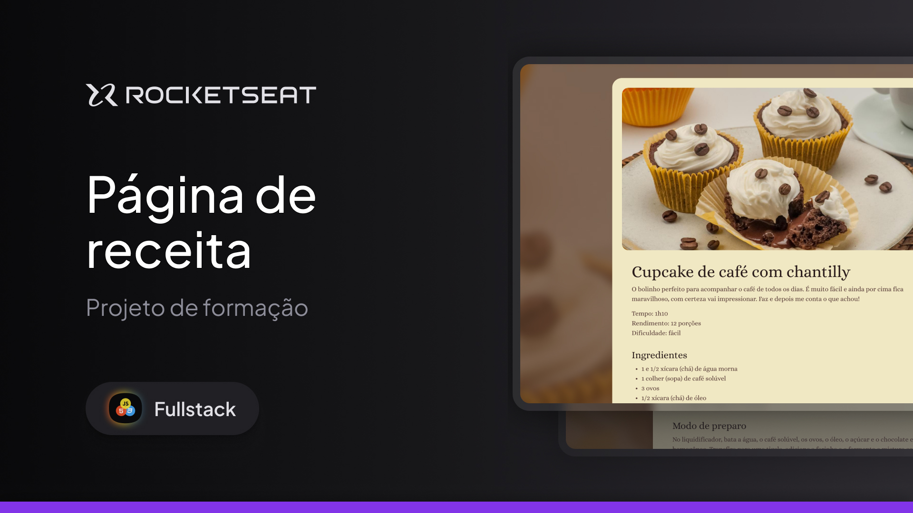

  

# 🧁 Projeto: Página de Receita - Cupcake de Café

Este projeto é uma página web estática desenvolvida com **HTML** e **CSS**, apresentando a receita de um cupcake de café com chantilly.

Ele foi desenvolvido como parte do curso **Formação Especialista em Full Stack** da Rocketseat.

---

## ✨ Sobre o projeto

A aplicação apresenta uma página de receita completa com:

- Descrição do prato
- Lista de ingredientes
- Modo de preparo detalhado
- Layout centralizado e estilizado
- Imagem principal da receita

---

## 🛠️ Tecnologias utilizadas

- HTML5
- CSS3
- Google Fonts (Alice)
- Imagens estáticas
- Figma

---

## 🎯 Objetivo

O objetivo deste projeto é praticar conceitos fundamentais de desenvolvimento web, como:

- Estruturação semântica com HTML
- Organização de conteúdo em seções
- Estilização com CSS
- Uso de imagens e tipografia personalizada
- Construção de layouts centralizados

---

## 🚀 Como visualizar o projeto

1. Acesse: https://Matheus-Souza97.github.io/PaginaDeReceita_CursoFullStack

---

## 📚 Aprendizados

Durante o desenvolvimento deste projeto, foram praticados:

- Uso de tags semânticas como `<main>`, `<section>` e `<footer>`
- Organização de conteúdo textual
- Estilização com CSS puro
- Uso de fontes externas do Google Fonts
- Estruturação de páginas com foco em legibilidade

---

## 💜 Créditos

Projeto desenvolvido durante a formação
**Formação Especialista em Full Stack - Rocketseat**

👉 https://www.rocketseat.com.br/

---

## 📄 Licença

Este projeto é apenas para fins de estudo.
